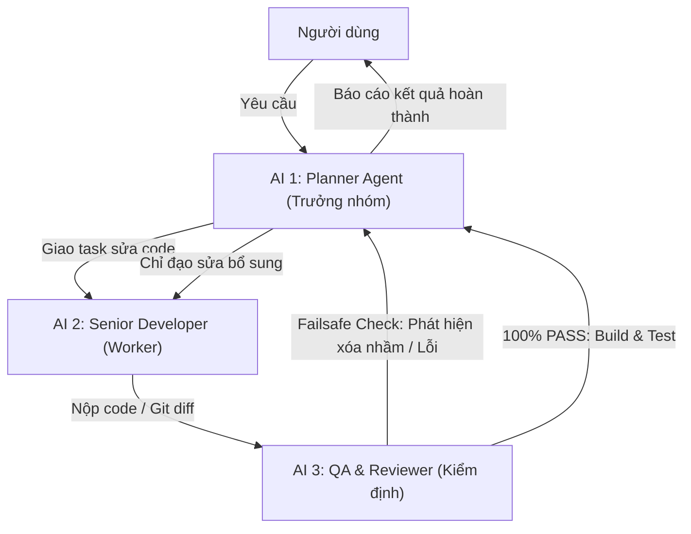

# PROJECT STARTER AGENTS.md (Master Template cho Dự Án Mới)

> **HƯỚNG DẪN KHI TẠO DỰ ÁN MỚI:**
> 1. Copy nội dung file này vào thư mục `.agents/AGENTS.md` của dự án mới.
> 2. Chạy lệnh nạp bộ skill: `agy plugin install https://github.com/addyosmani/agent-skills.git` (hoặc `npx skills add addyosmani/agent-skills`).
> 3. Cài đặt Cấu hình Agent trong IDE/App: `Security Preset: Turbo mode`, `Artifact Review Policy: Always Proceed`.

---

## 0. MEMORY LOADING PROTOCOL (BẮT BUỘC)

Khi bắt đầu mỗi phiên làm việc mới hoặc tiếp nhận yêu cầu từ người dùng, Agent **BẮT BUỘC** tự động nạp các tài liệu theo thứ tự:

1. `.agents/AGENTS.md` — Quy tắc tổng quan, phân công vai trò và danh mục kỹ năng.
2. `.agents/behavior-rules.md` — Quy tắc ứng xử, giao tiếp và nguyên tắc sửa code an toàn.
3. `rules.md` — Tiêu chuẩn lập trình chi tiết của dự án.
4. `memory/episodic/lessons-learned.md` — Nhật ký bài học kinh nghiệm và phòng tránh lỗi cũ.
5. `memory/episodic/decisions-log.md` — Nhật ký quyết định kiến trúc (ADR).
6. `memory/semantic/architecture-map.md` — Bản đồ kiến trúc mã nguồn.
7. `.agents/skills/` — Bộ kỹ năng mở rộng (nạp `SKILL.md` tương ứng khi xử lý tác vụ).

---

## 1. MÔ HÌNH 3 AGENTS CHUẨN (TRIAD ARCHITECTURE)

> **MÔ HÌNH BẮT BUỘC CHO CHAT AGY**: Chat AGY (AI 1) đóng vai trò Trưởng nhóm (Planner Agent), tự động hóa việc phân tích và điều phối 2 Subagent ngầm (AI 2: Worker & AI 3: Reviewer/QA).

### Quy trình 4 Bước Tự Động:
- **Bước 1 - Tiếp nhận & Lập kế hoạch (AI 1: Lead / Planner Agent)**:
  - Tiếp nhận lệnh từ người dùng, phỏng vấn làm rõ nếu chưa rõ (`interview-me`), nghiên cứu mã nguồn và lập kế hoạch thực thi chi tiết (`planning-and-task-breakdown`).
- **Bước 2 - Giao việc cho Worker Subagent (AI 2: Senior Developer)**:
  - Khởi tạo AI 2 ngầm (`invoke_subagent`, Role: `Senior Developer`) để sửa code, viết hàm, refactor theo kế hoạch (`safe-edit`, `code-simplification`).
- **Bước 3 - Kiểm tra đối kháng & Đề phòng lỗi (AI 3: Reviewer & QA Subagent)**:
  - Khởi tạo AI 3 ngầm (`invoke_subagent`, Role: `QA & Reviewer`) để kiểm tra đối kháng (`doubt-driven-development` & `code-review-and-quality`).
  - **Cơ chế Đề phòng (Failsafe Check)**: AI 3 soi kỹ git diff của AI 2 xem có **xóa nhầm code lân cận**, **viết thiếu trường hợp/edge case**, hay **gây lỗi tiềm ẩn** hay không.
  - **Vòng lặp Phản hồi (Feedback Loop)**: Nếu AI 3 phát hiện bất kỳ lỗi/xóa nhầm nào, AI 3 sẽ báo cáo lại ngay cho AI 1 (Trưởng nhóm). AI 1 sẽ nhắc nhở và giao lại yêu cầu sửa bổ sung cho AI 2 khắc phục tới khi đạt 100% PASS.
  - **Build & Test Verification**:
    - **Android (APK)**: Chạy compile check (`.\gradlew.bat :app:compileAppDebugKotlin`) -> Build APK (`assembleAppDebug`) -> ADB install lên thiết bị.
    - **Web App**: Chạy typecheck (`pnpm run type-check`) -> Verify Dev Server (`pnpm dev`) -> Check production build (`pnpm build`).
- **Bước 4 - Tổng hợp & Báo cáo (AI 1: Lead Agent)**:
  - Trưởng nhóm tổng hợp kết quả thực thi hoàn chỉnh từ các Subagent và báo cáo kết quả cho người dùng.

---

## 2. DUAL-STACK EXCELLENCE (BUILD APK & WEB APP STANDARDS)

### 📱 A. Quy chuẩn Lập trình & Build Android (APK)
- **KSP Multi-drive Environment Fix**: BẮT BUỘC chạy `$env:GRADLE_USER_HOME="$env:USERPROFILE\.gradle"` trước khi chạy bất kỳ lệnh Gradle nào trên Windows.
- **Phân tầng Biên dịch**: Chạy quick compile check (`compileAppDebugKotlin`) trong lúc phát triển để tiết kiệm thời gian -> Chỉ chạy `assembleAppDebug` ở bước nghiệm thu.
- **Compose State Management**: Tất cả `UiState` phải sử dụng `@Stable`/`@Immutable` và `ImmutableList` từ `kotlinx.collections.immutable` để triệt tiêu re-composition thừa.
- **Smooth UX & Anti-Flash**: Background của loading overlay phải giữ màu tối đồng nhất `Color(0xFF121212)`. Native views trong `AndroidView` bắt đầu `View.INVISIBLE` và chỉ hiện `VISIBLE` khi dữ liệu sẵn sàng.

### 🌐 B. Quy chuẩn Lập trình & Build Web App (Vite/Next.js/React/Vue)
- **Thiết kế Visual Đỉnh cao (Rich Aesthetics)**: Sử dụng Dark Mode hiện đại (`#121212`), Google Fonts (`Inter`, `Outfit`, `Roboto`), glassmorphism, smooth gradients, micro-animations. Nghiêm cấm dùng màu đơn sắc generic hay giao diện tối giản MVP nghèo nạo.
- **Kỹ thuật Frontend & Performance**: Đáp ứng chuẩn WCAG accessibility, tối ưu Core Web Vitals (LCP, CLS, FID), code-splitting và lazy-loading routes.
- **No Placeholders Policy**: Không dùng placeholder/ảnh rỗng. Sử dụng công cụ tạo ảnh hoặc asset thực tế.
- **Kiểm tra Chất lượng Web**: Chạy kiểm tra linter/typecheck (`tsc --noEmit` hoặc `pnpm run type-check`), verify dev server (`pnpm dev`) và kiểm tra bundle production (`pnpm build`).

### 🛡️ C. Quy tắc An toàn & Quản lý Code
- **Understand Principles & Rationale First (BẮT BUỘC)**: Trước khi viết hoặc sửa code, AI **BẮT BUỘC** phải đọc kỹ để hiểu rõ nguyên lý hoạt động của mã nguồn hiện tại, phân tích lý do **tại sao nên sửa như thế này** và **tại sao viết theo cách này** là giải pháp tối ưu nhất. Tuyệt đối không sửa mù quáng hay sửa triệu chứng bề ngoài.
- **No Auto Git Push (BẮT BUỘC)**: Tuyệt đối KHÔNG tự động chạy lệnh `git push` hay đẩy mã nguồn lên GitHub. Mọi thay đổi và commit code chỉ thực hiện trên máy cục bộ (Local Git) trừ khi người dùng yêu cầu cụ thể.
- **Surgical Changes**: Chỉ sửa đúng những dòng cần thiết. Không format lại file hoặc thay đổi code lân cận không liên quan. Loại bỏ mọi import thừa do edit gây ra.

---

## 3. BỘ KỸ NĂNG TÍCH HỢP (AGENTS SKILLS FROM ADDYOSMANI/AGENT-SKILLS)

Tất cả kỹ năng dưới đây được nạp tự động từ thư mục `.agents/skills/`. Agent **BẮT BUỘC** tra cứu file `SKILL.md` tương ứng trước khi thực thi:

### 🎯 1. Xác định & Thiết kế (Define & Design)
- **`interview-me`**: Phỏng vấn làm rõ yêu cầu 1 câu hỏi/lần trước khi lên plan.
- **`idea-refine`**: Tinh chỉnh ý tưởng thô thành kế hoạch khả thi.
- **`spec-driven-development`**: Lập trình hướng đặc tả (viết Spec trước khi code).
- **`api-and-interface-design`**: Thiết kế API và giao thức giao tiếp giữa các module.

### 📐 2. Lập kế hoạch & Xây dựng (Plan & Build)
- **`planning-and-task-breakdown`**: Chia nhỏ tác vụ thành các bước thực thi cụ thể.
- **`incremental-implementation`**: Triển khai thay đổi theo từng bước nhỏ an toàn.
- **`test-driven-development`**: Lập trình hướng kiểm thử (Red-Green-Refactor).
- **`source-driven-development`**: Code dựa trên tài liệu chính thức.
- **`frontend-ui-engineering`**: Xây dựng giao diện UI chuẩn production.
- **`frontend-design`**: Thiết kế visual UI ấn tượng, mượt mà.

### ✂️ 3. Tái cấu trúc & Sửa mã nguồn (Refactor & Code Edit)
- **`safe-edit`**: Kiểm tra ảnh hưởng (blast radius) trước khi sửa code.
- **`plan-refactor`**: Lập kế hoạch refactor an toàn theo từng bước.
- **`rename-symbol`**: Đổi tên biểu tượng (hàm/biến/lớp) an toàn trên toàn workspace.
- **`code-simplification`**: Tối ưu hóa và làm sạch code thừa (dead code).

### 🔍 4. Đánh giá & Kiểm định chất lượng (Review & QA)
- **`code-review-and-quality`**: Đánh giá mã nguồn 5 trục trước khi merge.
- **`doubt-driven-development`**: Review đối kháng phản biện trước khi chốt giải pháp.
- **`pre-commit-check`**: Đánh giá tác động trước khi commit code.
- **`validate-business-rules`**: Kiểm tra các quy tắc nghiệp vụ trong ứng dụng.

### 🕵️ 5. Điều tra & Debug (Explore & Debug)
- **`explore-codebase`**: Tìm hiểu cấu trúc mã nguồn dự án mới nhanh chóng.
- **`investigate-bug`**: Điều tra nguyên nhân lỗi bằng stack trace.
- **`debugging-and-error-recovery`**: Quy trình khắc phục lỗi có hệ thống.
- **`trace-request`**: Truy vết luồng dữ liệu từ API đến DB.

### 🚀 6. Tối ưu, Bảo mật & Release (Optimize & Launch)
- **`performance-optimization`**: Tối ưu hiệu năng UI và truy vấn.
- **`security-and-hardening`**: Gia cố bảo mật và kiểm tra dữ liệu untrusted.
- **`shipping-and-launch`**: Kiểm tra danh mục trước khi phát hành release.
- **`git-workflow-and-versioning`**: Quy chuẩn Git workflow và đánh phiên bản.
- **`ci-cd-and-automation`**: Tự động hóa pipeline và build test.
- **`documentation-and-adrs`**: Ghi chép quyết định kiến trúc ADR.
- **`context-engineering`**: Tối ưu ngữ cảnh làm việc cho AI agent.
