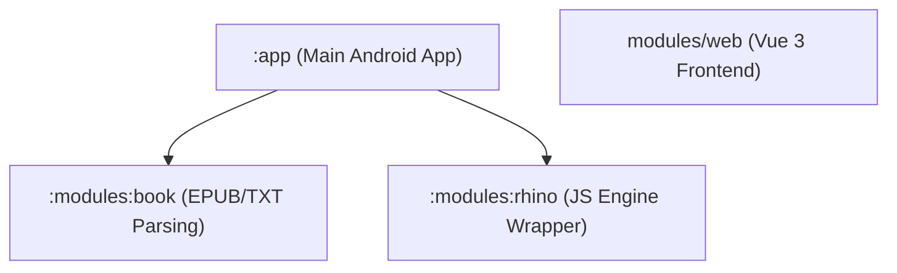

# Architecture Map

Bản đồ kiến trúc nhanh và luồng dữ liệu của dự án Novela.

---

## 1. Modules Structure
Dự án được tổ chức dưới dạng Multi-module giúp tách biệt rõ ràng các trách nhiệm:

- **`:app`**: Chứa toàn bộ giao diện Compose, logic điều hướng, ViewModels, Services và cơ sở dữ liệu Room.
- **`:modules:book`**: Module chuyên biệt xử lý đọc và phân tích cấu trúc các định dạng sách EPUB/TXT (sử dụng namespace `me.ag2s`).
- **`:modules:rhino`**: Trình bao bọc công cụ chạy JavaScript Rhino phục vụ việc cào dữ liệu từ các nguồn sách (Book Source).
- **`modules/web/`**: Giao diện quản lý nguồn sách, tủ sách trên trình duyệt máy tính (Vue 3 + TS + Vite, giao tiếp với máy chủ HTTP Ktor chạy trong `:app`).

## 2. Clean Architecture Layers (trong `:app`)
Kiến trúc mã nguồn bên trong module `:app` được chia thành các phân lớp như sau:

- **`data/`**: Room Database (định nghĩa các Entities, DAOs) và triển khai cụ thể của các Repository (Gateways).
- **`domain/`**: Khai báo các cổng giao tiếp (Gateway interfaces), các ca sử dụng (Use Cases), và các mô hình dữ liệu lõi (Domain Models) độc lập hoàn toàn với framework Android.
- **`ui/`**: Màn hình Compose (Screens), ViewModels quản lý trạng thái, và Jetpack Navigation 3 routes.
- **`help/`**: Các trợ thủ đắc lực xử lý mạng (OkHttp/Cronet), backup dữ liệu (WebDAV), bộ máy JavaScript (JS Engine), cấu hình ứng dụng.
- **`model/`**: Trạng thái chạy runtime (như trạng thái phát âm thanh `AudioPlay`, đọc sách `ReadBook`, hàng đợi tải sách `CacheBook`).
- **`service/`**: Các Android Service chạy nền (Background/Foreground Services).
- **`web/`**: Máy chủ HTTP nhúng Ktor chạy trên điện thoại phục vụ giao diện Web quản lý.
